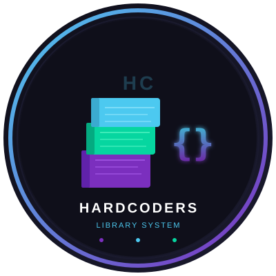

<p align="center">
  
</p>


<h1 align="center">HardCoders – Library Management System</h1>

<p align="center">
  A C++17 GUI application for managing a school library, built with <a href="https://www.raylib.com/">Raylib</a> and a strict three-tier architecture.
</p>

<p align="center">
  
  
  
  
</p>

---

## Team — HardCoders

| Name | Role | Email |
|------|------|-------|
| **Georgi Hristov** | Scrum Master | GIHristov24@codingburgas.bg |
| **Zlati Georgakiev** | Back-End Developer | ZIGeorgakiev24@codingburgas.bg |
| **Ian Krylov** | Front-End Developer | IMKrylov24@codingburgas.bg |

---

## Features

- **View** all books in a scrollable table
- **Add** books with a live form and duplicate/validation checks
- **Search** by author or genre — case-insensitive, partial match
- **Sort** by title or year using Bubble Sort
- **Delete** books by ID
- **Recursion demo** — recursive sum of all publication years
- All data is saved automatically to `data/books.txt`

---

## Architecture

The project strictly follows **three-tier architecture**. Each layer has one job and only talks to the layer below it.

```
UI  ──calls──►  Logic  ──calls──►  Data
```

| Layer | Files | Responsibility |
|-------|-------|----------------|
| **Data** | `book.h`, `storage.h/.cpp`, `constants.h` | `Book` struct + reading/writing `books.txt` |
| **Logic** | `logic.h`, `validation.cpp`, `book_ops.cpp`, `search.cpp`, `sort.cpp`, `utils.cpp` | Validation, algorithms, business rules |
| **UI** | `ui.h`, `ui_state.h`, `ui_sidebar/table/form/search/sort/content.cpp` | Raylib window, input, rendering |

> The UI never touches files directly. Logic never prints anything. Data knows nothing about the other layers.

---

## Project Structure

```
HardCoders/
├── include/
│   ├── book.h            ← Book struct                      [DATA]
│   ├── storage.h         ← file I/O declarations            [DATA]
│   ├── constants.h       ← app-wide constants               [DATA]
│   ├── utils.h           ← string helper declarations       [LOGIC]
│   ├── logic.h           ← all business logic declarations  [LOGIC]
│   ├── ui_state.h        ← UI state struct + Screen enum    [UI]
│   └── ui.h              ← UI function declarations         [UI]
├── src/
│   ├── main.cpp          ← entry point, window loop
│   ├── storage.cpp       ← load/save books from file        [DATA]
│   ├── utils.cpp         ← toLowerStr, containsIgnoreCase   [LOGIC]
│   ├── validation.cpp    ← validateBook, bookExists         [LOGIC]
│   ├── book_ops.cpp      ← addBook, removeBook              [LOGIC]
│   ├── search.cpp        ← searchByAuthor, searchByGenre    [LOGIC]
│   ├── sort.cpp          ← sortByTitle, sortByYear, sumYears[LOGIC]
│   ├── ui_sidebar.cpp    ← left navigation panel            [UI]
│   ├── ui_table.cpp      ← book table renderer              [UI]
│   ├── ui_form.cpp       ← add-book form with text input    [UI]
│   ├── ui_search.cpp     ← search panel                     [UI]
│   ├── ui_sort.cpp       ← sort panel + recursion stats     [UI]
│   └── ui_content.cpp    ← screen router + status bar       [UI]
├── data/
│   └── books.txt         ← pipe-delimited data file
├── docs/
│   ├── logo.svg
│   └── architecture.md
├── CMakeLists.txt
└── README.md
```

---

## How to Build

**Requirements:** CMake 3.14+, a C++17 compiler (`g++` / `clang` / MSVC), `git`.
Raylib 5.0 is downloaded automatically — no manual install needed.

```bash
# 1. Clone the repo
git clone <repo-url>
cd HardCoders

# 2. Configure and build
mkdir build && cd build
cmake ..
cmake --build .

# 3. Run
./library          # Linux / macOS
library.exe        # Windows
```

> The `data/` folder is copied next to the executable automatically by CMake.

---

## Algorithms

| Algorithm | Function | File |
|-----------|----------|------|
| Bubble Sort | `sortByTitle()` / `sortByYear()` | `sort.cpp` |
| Linear Search | `searchByAuthor()` / `searchByGenre()` | `search.cpp` |
| Recursion | `sumYears(books, index)` | `sort.cpp` |

---

## Data Format

Books are stored in `data/books.txt` as pipe-delimited records:

```
1|Under the Yoke|Ivan Vazov|Novel|1894
2|The Little Prince|Antoine de Saint-Exupery|Fantasy|1943
```

---

## License

School project — CodingBurgas, 9th grade, 2025/2026.
